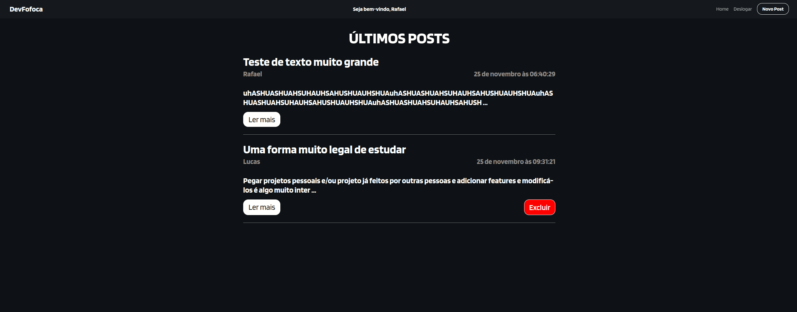

# small_blog

## Resumo

Projeto de construção de um miniblog fullstack com backend em NodeJs, banco de dados MySQL e frontend com React e Axios para consumir a API criada em arquitetura MSC. 

## Tópicos 

[Preview](#preview)

[Sobre o Blog Fullstack](#sobre-o-blog)

[Tecnologias](#tecnologias)

[Instalação e uso](#instalação-e-uso)

<br>

## Preview

<a title="Pokedex" href="https://github.com/LEXW3B/small_blog/" >Clique aqui </a> para ter acesso a um  preview do App.<br>

## Sobre o Blog
<br>
<p align="center">
  
</p>
<br>
O projeto blog Fullstack foi criado visando estudar e criar um ambiente fullstack completo, aumentando o domínio sobre as ferramentas que já possuo e ampliar com conceito ainda não vistos.

<b>O projeto utiliza React para a parte de frontend, NodeJS para a parte de backend com construção de uma API Restful, Docker para utilização do banco de dados (MySQL) com arquitetura MSC (model-service-controller).</b>

Na página Home, mostra os posts dos usuários cadastrados via localstorage, com limite de caracteres no corpo de 150. Para mostrar o post inteiro sem limites, existe o botão "Leia mais". Ao entrar na página, irá ser feita uma requisição no banco de dados via API Node que irá retornar todos os posts cadastrados no banco de dados naquele momento.
<br>

Podemos cadastrar um novo post ao clicar no botão "Novo Post", onde iremos consumir uma rota post da API para cadastro dos dados no banco de dados.
Somente as pessoas que são donas do post (possuam nome idêntico no localStorage e no banco de dados) poderá apagar os posts de quem são donas. Assim, o botão de "Excluir" irá aparecer, podendo assim consumir a rota delete e apagar os dados do banco de dados;

<br>

## Tecnologias

Tecnologias e ferramentas utilizadas no desenvolvimento do projeto:

- [VS Code](https://code.visualstudio.com/) com [ESLint](https://eslint.org/)
- [JavaScript]()
- [React]()
- [NodeJs]()
- [Docker]()
- [MySQL]()
- [Arquitetura MSC]()

<br>

## Instalação e uso

```bash
# Abra um terminal e copie este repositório com o comando
git clone git@github.com:LEXW3B/small_blog.git

# Entre na pasta backend 
cd backend/

# Instale as dependências
yarn install
ou 
npm install

# Rode o servidor
npm run dev

# Para ter acesso a API
http://localhost:3000/posts

# Para ter acesso a 1 item específico da API
http://localhost:3000/posts/:id

# Saia da pasta backend e entre na pasta Frontend
cd ..
cd frontend/

# Rode o script de frontend
npm run dev

# Rode o aplicação
usando extensão Live Server no vs-code

# Acesse http://localhost:3000/ no seu navagador.
```

<br>
---
